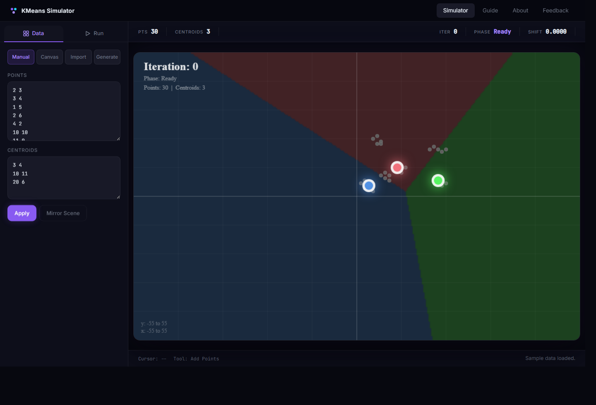
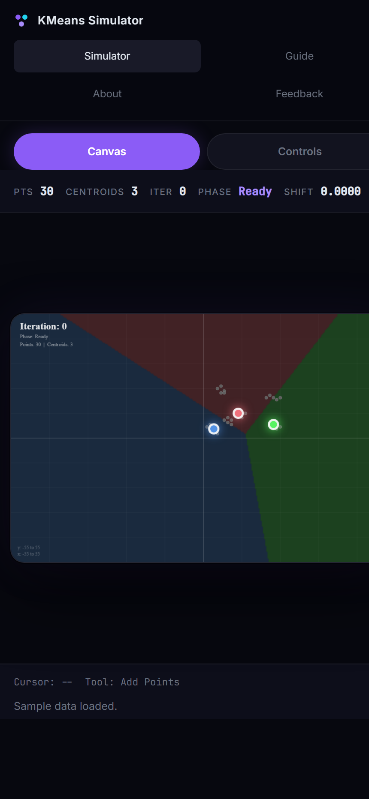

# KMeans Simulator

Interactive web app for visualizing k-means clustering and the Lloyd-Forgy update process in real time.

Live demo: https://kmeans-simulator.vercel.app

## Overview

KMeans Simulator is an interactive visualization tool for exploring how Lloyd-Forgy k-means clustering behaves across different datasets, centroid placements, and stopping conditions. It lets users build scenes manually, import coordinate sets, generate synthetic data, and watch assignments and centroid movement update step by step.

The app is designed for:

- learning how k-means works
- demonstrating Lloyd's algorithm visually
- testing different centroid placements and dataset shapes
- sharing the simulator online without requiring a local build

## Preview

  

  

## Features

- manual entry of point and centroid coordinates
- click-to-place editing directly on the canvas
- structured text import for point and centroid datasets
- random dataset generation with seed-based reproducibility
- adjustable animation delay and centroid interpolation frames
- epsilon-based stopping or max-iteration stopping
- mobile-friendly simulator workspace with touch canvas support
- guide and theory pages built into the app

## How It Works

For each iteration, the simulator:

1. assigns every point to its nearest centroid
2. recomputes each centroid as the mean of its assigned points
3. animates the centroid movement
4. repeats until convergence or until the maximum iteration limit is reached

The visualization also shows:

- current iteration number
- current phase of the algorithm
- centroid shift value
- Voronoi-style background ownership regions

## Input Modes

- `Manual`: type one `x y` coordinate pair per line
- `Canvas`: click to add points, add centroids, or erase the nearest item
- `Import`: paste or upload a compatible `N ... K` coordinate dataset
- `Generate`: create a random scene using profile, spread, noise, world size, and seed controls

## Project Structure

The deployable app lives in [kmeans-app](./kmeans-app).

- [kmeans-app/index.html](./kmeans-app/index.html) - UI structure and content pages
- [kmeans-app/styles.css](./kmeans-app/styles.css) - styling, layout, and responsive behavior
- [kmeans-app/app.js](./kmeans-app/app.js) - simulator logic, animation, parsing, and interaction
- [kmeans-app/input.txt](./kmeans-app/input.txt) - sample dataset
- [kmeans-app/vercel.json](./kmeans-app/vercel.json) - Vercel configuration
